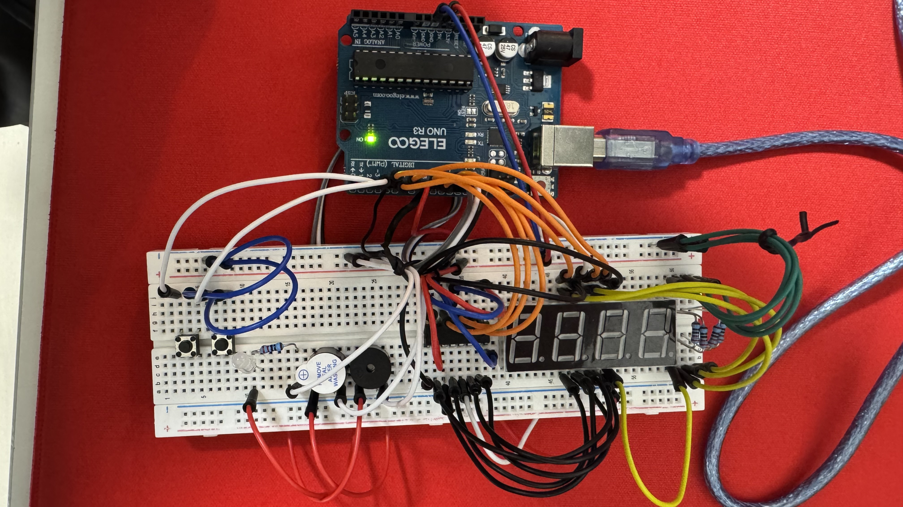

# 成果発表レポート

> 記入者: 竹下倖詩
> グループ: 1-E
> 日付: 2026/05/27

> **📝 このレポートをそのまま発表原稿にできます。**
> 各セクションの指示を消して、自分の言葉で書いてください。
> 1人 **約2分**（グループ5人で10〜12分）に収まる分量が目安です。

---

## 1. 何を作ったか（30秒）

<!-- ひと言で伝わるように書いてください。「○○を使って、△△するガジェットを作りました。」 -->

**ガジェット名：**
- 反応速度計測マシーン

**ひと言で説明：**
- 自分の反応速度を計測することが出来る。

**使った部品：**
- アクティブブザー
- LED(白)
- パッシブブザー
- ボタン(2個)
- 4桁の7セグメントディスプレイ
- 74HC595 IC
- 220Ω抵抗(5個)

---

## 2. 設計で考えたこと（15秒）

<!-- 要件定義・基本設計・詳細設計の中で、自分なりに考えたこと・工夫した点を書いてください -->
<!-- 「なぜこの部品を選んだか」「なぜこの構成にしたか」など、判断の理由を言葉にしてください -->
- 初期状態ではボタンが押している間だけ動くといった仕様だったが、ボタンを押したらオンの状態を維持する設計を行った。

---

## 3. できたこと・できなかったこと（30秒）

<!-- 正直に書いてください。「できなかった」も立派な成果です -->

**動いたもの：**
- システム全般の流れ

**動かなかった・間に合わなかったもの：**
- 結果表示後、開始ボタンを押すまで4桁の7セグメントディスプレイに結果を表示したままにすること
- タイムアウト機能

- なぜ動かなかったか（わかる範囲で）：一回限りのループ内でしか回していなく、一度表示するとその時点でループを抜け、ダイナミック点灯という方式で今回作成したが、その性質上消えてしまうから。

---

## 4. 一番苦労したこと、どう乗り越えたか（30秒）

<!-- ここが発表の山場です。1つだけに絞って、ストーリーで書いてください -->

**何が起きたか：**
- 4桁の7セグメントディスプレイの仕組みを理解することに苦労した

**どう対処したか：**
- copilotに聞いたり、インターネット上で4桁7セグの仕組みや注意点等を解説しているwebサイトを参考にした

**そこから何がわかったか：**
- 4桁7セグの各ピンの接続場所や表示方法

---

## 5. 学んだこと・今後の展望（25秒）

<!-- 「勉強になった」ではなく具体的に。 -->
<!-- 例: 「AIが生成したコードをそのまま使ったら動かず、自分でprintfデバッグして原因を特定した」 -->
<!-- 例: 「配線図を書かずに組んだら混乱した。図を書いてからやり直したらすぐ動いた」 -->

**学んだこと：**
- 自分である程度枠組みを作り、詳細な部分をAIに生成させることで、動かないといった状況になることが無く、作成することが出来た。

**今後の展望（この仕組みを発展させるなら）：**
<!-- 例: 「温度センサー＋モーターの組み合わせを応用すれば、室温に応じて自動で換気する仕組みが作れそう」 -->

- 今回は追加しなかったが、ダミーの情報も混ぜることによって、反応速度を鍛えることが出来そう。

---

## 6. 発表で見せたいもの（メモ）

<!-- 動くデモ、配線の写真、設計図、フローチャート、AIとのやり取りのスクショなど -->
<!-- 動くものがなくても、「考えた過程」を見せられれば十分です -->

<video controls src="WIN_20260527_16_38_25_Pro.mp4" title="Title"></video>
---

<!-- > **💡 書き終わったら** -->
<!-- > - 声に出して読んで、2分に収まるか確認してください -->
<!-- > - 長すぎたら「4. 苦労したこと」を1つに絞りましょう -->
<!-- > - グループで導入・締めをつけたい場合は、次の時間に相談して決めてください -->
